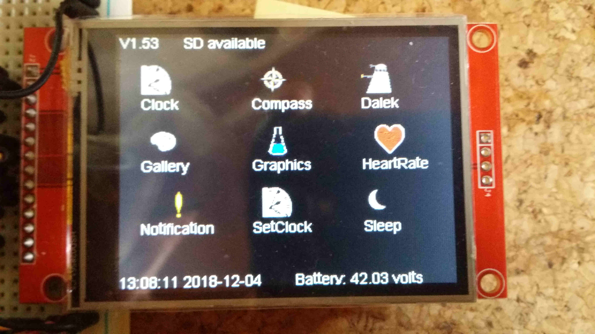

MakeIcons
--

This is a bit rough but I use it to make bitmaps I can embed into my C code which I can then use as displayable icons.

To make the icons I use Gimp to create a 28x28 pixel image then export it as a .h file. This .h file cannot be directly used because it is an awkward format. So I pass it through a transformation I wrote in C++.

Because this is just a utility, and I only have 10 icons I just paste the output from Gimp into a static char * in MakeIcons.cpp. You'll find then all near the top. Then in the main method I process each one.
For each of them I create an Icon object and then call the Icon's draw() method. That writes out the bitmap in a useable format. The smart stuff in this is in that draw() method where it does a lot of bit shifting etc to get the 16 bit output right. And then it prints it out. The result looks like this:

```
static uint16_t myicon[] PROGMEM = {
	0x0000,0x0000,0x0000,0x0000,0x0841,0xffdf,0xffdf,0xffdf,0xffdf,0xffdf,0x0841,0x0000,0x0000,0x0000,0x0000,0x0000,0x0000,0x0841,0xffdf,0xffdf,0xffdf,0xffdf,0xffdf,0xffdf,0x0000,0x0000,0x0000,0x0000,
	0x0000,0x0000,0x0000,0xf79e,0xffdf,0xfa8a,0xf8c3,0xf8c3,0xf8c3,0xf9c7,0xe410,0xf79e,0x0000,0x0000,0x0000,0x0000,0xf79e,0xffdf,0xfa08,0xf8c3,0xf8c3,0xf8c3,0xfa49,0xffdf,0xf79e,0x0841,0x0000,0x0000,
...
```

In my main project (the one that actually displays the icons) I paste that bitmap into the relevant cpp file and drw it with code like this (assume the *icon points to the 16 bit icon):

```
int count = 0;
for (unsigned int j = 0; j < size; j++) {

	for (unsigned int i = 0; i < size; i++) {
		uint16_t pixel = icon[count++];
		if (reversed) {
			pixel = ~pixel;
		}
		Graphics.drawPixel(x + i, y + j, pixel);
	}
}
```

The size variable is almost always 28 because we started with a 28x28 pixel image. But you can change the size and you'll see I do this in the last bitmap which is a 14x14 image. The same code is used to display that icon, as long as I tell it the right size. I can also optionally reverse the image by setting a flag which just negates each pixel.



And that's the result. They're fairly crisp and they have the right colours. My early attempts messed up the colours while retaining the shapes all right and I was very pleased when I got that fixed.

